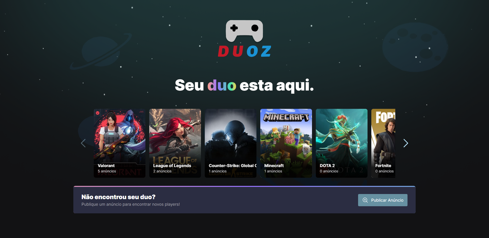
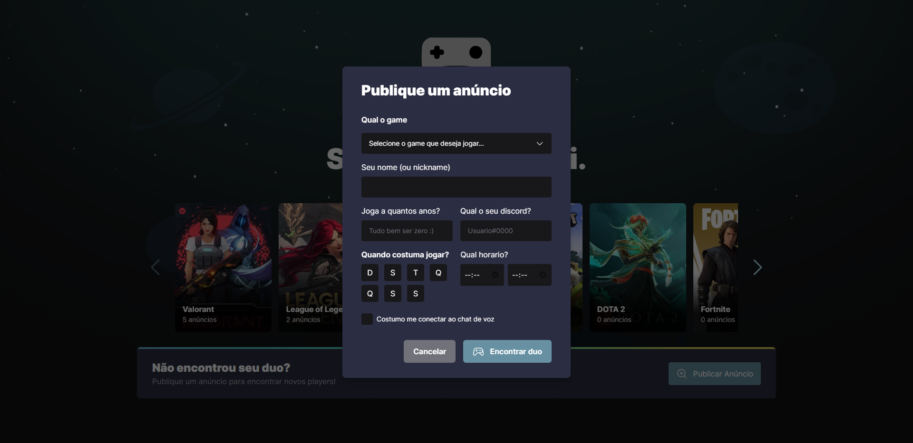
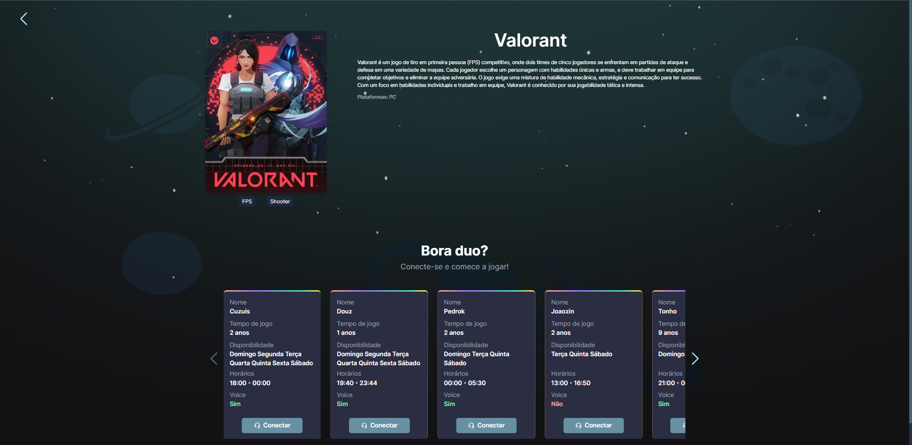
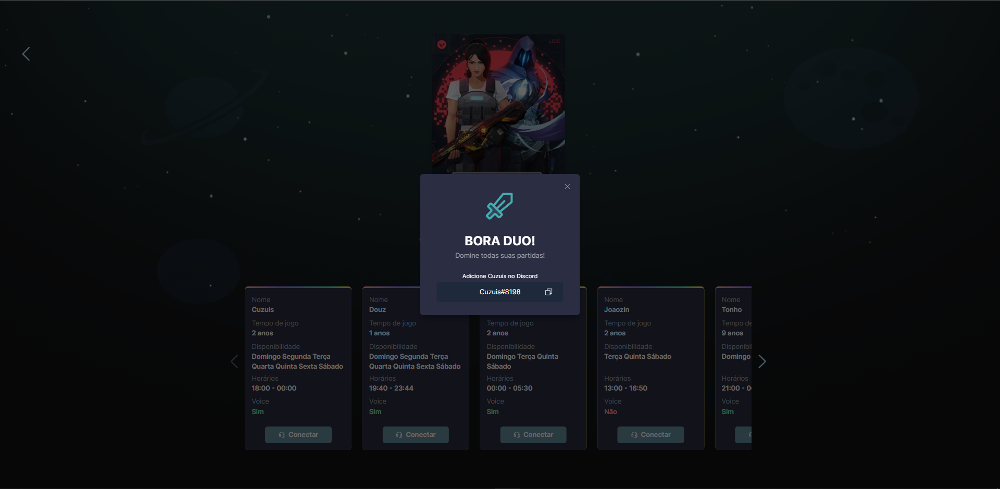
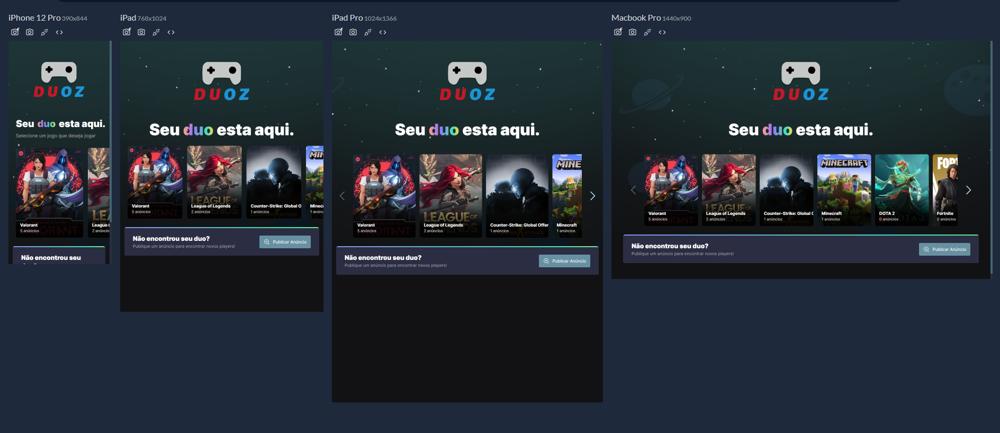

   

 

   
    
    

 

   

 
<a href="#english"><b><i>Read it in English</i></b></a>
 
 

[**Links**](#-links) &nbsp;&nbsp;**|**&nbsp;&nbsp;
[**Projeto**](#-projeto) &nbsp;&nbsp;**|**&nbsp;&nbsp;
[**Tecnologias**](#-tecnologias) &nbsp;&nbsp;**|**&nbsp;&nbsp;
[**Instalação**](#-instalação) &nbsp;&nbsp;**|**&nbsp;&nbsp;

## 🔗 Links

O projeto pode ser acompanhado através do link: <a href="https://douz.vercel.app/" target="_blank">**DOUZ**</a>.

## 🎮 Projeto

 

**Duoz** é o projeto desenvolvido com aspectos e inspirações no projeto aprensentado pela **Next Level Week**, um evento online produzido pela [**Rocketseat**](https://github.com/Rocketseat).

 
 

 

 

 
 

Projeto totalmente responsivo e funcional.

 

## 🚀 Tecnologias

### Web + Server

<ul>
   <li>Javascript (https://www.javascript.com/)</li>
   <li>Typescript (https://www.typescriptlang.org/)</li>
   <li>ReactJS (https://reactjs.org/)</li>
   <li>Tailwind CSS (https://tailwindcss.com/)</li>
   <li>Radix UI (https://www.radix-ui.com/)</li>
   <li>Axios (https://axios-http.com/ptbr/docs/intro)</li>
   <li>Prisma (https://prisma.io/)</li>
   <li>PostgreSQL (https://www.postgresql.org/)</li>
   <li>React Hook Form (https://react-hook-form.com/)</li>
   <li>Phosphor Icons (https://phosphoricons.com/)</li>
   <li>ZOD (https://zod.dev/)</li>
   <li>Vercel - Hospedagem Web/Server (https://vercel.com/)</li>
   <li>Neon - Hospedagem PostgreSQL ((https://neon.tech/))</li>
</ul>

## 🔧 Instalação

1. Renomeie o arquivo `.env.example` para `.env` dentro da pasta `server`
1. Semeie os games no banco de dados rodando `yarn seed` dentro da pasta `server`
1. Inicie o servidor do backend em um terminal, rodando o comando `npm run dev` ou `yarn dev` dentro da pasta `server`
1. Inicie o servidor da web em outro terminal, rodando `npm run dev` ou `yarn dev` dentro da pasta `web`
1. Para utilizar o aplicativo web, basta abrir [http://localhost:5173](http://localhost:5173) em algum browser

## 💡 Contribuição

- Faça um **_fork_** desse repositório;
- Crie um **branch** para a sua feature: `git checkout -b minha-feature`;
- Faça um **commit** com suas alterações: `git commit -m 'feat: Minha nova feature'`;
- Faça um **push** para a sua branch: `git push origin minha-feature`;
- Faça um **pull request** com sua feature;

Pull requests são sempre bem-vindos. Em caso de dúvidas ou sugestões, crie uma _**issue**_ ou entre em contato comigo.

## 📝 Licença

Esse projeto está sob a licença **MIT**. Veja o arquivo _**LICENSE**_ para mais detalhes.

---

_English version_

 

[**Links**](#-links) &nbsp;&nbsp;**|**&nbsp;&nbsp;
[**Project**](#-project) &nbsp;&nbsp;**|**&nbsp;&nbsp;
[**Technologies**](#-technologies) &nbsp;&nbsp;**|**&nbsp;&nbsp;
[**Installation**](#-installation) &nbsp;&nbsp;**|**&nbsp;&nbsp;

## 🔗 Links

The project can be followed through the link: <a href="https://douz.vercel.app/" target="_blank">**DUOZ**</a>.

## 🎮 Project

 
 

**Duoz** is the project developed with aspects and inspirations from the project presented by **Next Level Week**, an online event produced by [**Rocketseat**](https://github.com/Rocketseat).
 
 

 

 

 

 
 

Fully responsive and functional design.

 

## 🚀 Technologies

### Web + Server

<ul>
   <li>Javascript (https://www.javascript.com/)</li>
   <li>Typescript (https://www.typescriptlang.org/)</li>
   <li>ReactJS (https://reactjs.org/)</li>
   <li>Tailwind CSS (https://tailwindcss.com/)</li>
   <li>Radix UI (https://www.radix-ui.com/)</li>
   <li>Axios (https://axios-http.com/ptbr/docs/intro)</li>
   <li>Prisma (https://prisma.io/)</li>
   <li>PostgreSQL (https://www.postgresql.org/)</li>
   <li>React Hook Form (https://react-hook-form.com/)</li>
   <li>Phosphor Icons (https://phosphoricons.com/)</li>
   <li>ZOD (https://zod.dev/)</li>
   <li>Vercel - Hospedagem Web/Server (https://vercel.com/)</li>
   <li>Neon - Hospedagem PostgreSQL ((https://neon.tech/))</li>
</ul>

## 🔧 Installation

1. Rename the `.env.example` file to `.env` inside the `server` folder
1. Seed the games into the database by running `yarn seed` inside the `server` folder
1. start the backend server in a terminal by running `npm run dev` or `yarn dev` inside the `server` folder
1. start the web server in another terminal by running `npm run dev` or `yarn dev` from within the `web` folder
1. To use the web application, just open [http://localhost:5173](http://localhost:5173) in some web browser

## 💡 Contribution

- Do a **_fork_** of that repository;
- Create a **branch** for your feature: `git checkout -b minha-feature`;
- Make a **commit** with your changes: `git commit -m 'feat: Minha nova feature'`;
- Make a **push** to your branch: `git push origin minha-feature`;
- Make a **pull request** with your feature;

Pull requests are always welcome. If you have any questions or suggestions, please create an _**issue**_ or contact me.

## 📝 License

This project is under the **MIT** license. See the _**LICENSE**_ file for more details.

---

<h5 align="center">
  &copy;2023 - <a href="https://github.com/SSilvaGustavo/">Gustavo Silva</a>
</h5>

<a href='#top'>🔼 Back to top</a>
